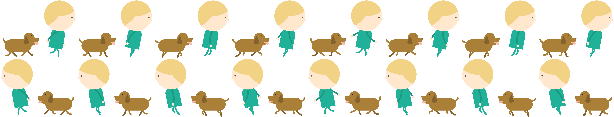

# 📝 LEEHEEWON PORTFOLIO

> **"사용자 경험의 디테일을 설계하는 프론트엔드 개발자 이희원입니다."**
> 단순한 포트폴리오를 넘어, 직접 제작한 비주얼 에셋과 부드러운 인터랙션으로 몰입감 있는 사용자 경험을 제공합니다.

---

### 🔗 Live Demo

- **URL:** [https://my-walking-portfolio.vercel.app/](https://my-walking-portfolio.vercel.app/)

---

### 🎨 Creative Direction: Hand-Drawn Assets



> _프로젝트에 사용된 모든 캐릭터, 배경 및 애니메이션 에셋은 직접 드로잉하여 제작되었습니다._

- **100% Self-Created Visuals**: 외부 소스 없이 캐릭터, 배경 숲, 오브젝트 등 모든 에셋을 직접 설계하여 독창적인 **#d4d77c (Muted Olive)** 톤앤매너 구현
- **Frame-by-Frame Animation**: 캐릭터의 걷기 모션을 8프레임 스프라이트 시트로 직접 설계하여 생동감 있는 워킹 애니메이션 구현
- **Asset Optimization**: 웹 환경에 최적화된 에셋 구조를 설계하여, 고퀄리티 비주얼과 빠른 로딩 속도 사이의 균형을 유지

---

### 🛠️ Tech Stack

- **Framework:** `Next.js 14+ (App Router)`
- **Language:** `TypeScript`
- **Styling:** `Tailwind CSS`
- **Animation:** `Framer Motion`
- **Deployment:** `Vercel`

---

### ✨ Key Features & Technical Challenges

#### 1. Hybrid Scroll Interaction (수직-수평 하이브리드 스크롤)

- **Challenge:** 정적인 수직 스크롤 흐름 속에서 특정 섹션을 수평으로 이동하는 몰입감 있는 레이아웃 필요
- **Solution:** `Framer Motion`의 `useScroll`과 `useTransform`을 결합하여 스크롤 진행도(`scrollYProgress`)에 따라 `x`축 값을 제어하는 **Sticky-Horizontal Scroll** 구조 설계

#### 2. SSR Stability & Hydration Strategy

- **Problem:** 브라우저 API에 의존하는 애니메이션 컴포넌트에서 서버/클라이언트 상태 불일치로 인한 Hydration 에러 발생
- **Solution:** `ClientOnly` 공통 래퍼 컴포넌트와 `isMounted` 커스텀 훅을 도입하여 하이드레이션 오류를 원천 차단하고, SSR 환경에서도 안정적인 렌더링 보장

#### 3. Advanced Portal-based UI Layering

- **Challenge:** `Framer Motion`의 `transform` 속성으로 인해 발생하는 **Stacking Context(쌓임 맥락)** 문제로 팝업이 특정 레이어 아래로 숨는 결함 발견.
- **Solution:** React **`Portal`**을 활용하여 팝업과 모달 요소를 DOM 최상단으로 분리 렌더링함으로써, 복잡한 애니메이션 환경에서도 완벽한 레이어 우선순위 제어

#### 4. Web Accessibility & Focus Management (A11y)

- **Problem:** 수평 스크롤 중 화면 밖에 위치한 요소에 `Tab` 키 포커스가 닿아 화면이 강제로 이동하는 UX 결함 발견
- **Solution:** `inert` 속성을 활용해 비활성 섹션의 상호작용을 차단하는 **Focus Guard** 로직 구현

#### 5. Systematic Z-Index & Mobile Viewport Scaling

- **Detail:** 아이폰 16 Pro(402px) 등 최신 기기 뷰포트를 고려하여 캐릭터 및 UI 스케일을 **3/4 비율**로 정교하게 조정, 전역적인 **Z-Index System**을 통해 관리 효율성 극대화

| Layer                          | Z-Index | Description                        |
| :----------------------------- | :------ | :--------------------------------- |
| **Overlay/Modal (Portal)**     | 700+    | 포탈을 통한 최상위 팝업/모달       |
| **Progress Bar**               | 510     | 스크롤 인디케이터 (헤더 위)        |
| **Header**                     | 500     | 내비게이션 바                      |
| **Interactive UI - Character** | 300     | 수평 스크롤 걷는 캐릭터            |
| **Interactive UI - Bubble**    | 100~200 | 캐릭터 말풍선 등 상호작용 요소     |
| **Background Decor**           | 40~110  | 도로, 나무, 바닥 등 배경 장식 요소 |

---

### 📂 Directory Structure

```text
src/
├── components/
│   ├── common/         # ClientOnly, Portal, HintBubble 등 공용 컴포넌트
│   ├── character/      # 직접 그린 스프라이트 캐릭터 컴포넌트
│   ├── sections/       # 프로젝트 섹션 전용 컴포넌트
├── providers/          # Theme Providers
├── constants/          # 에셋 경로 및 프로젝트 데이터 관리
├── lib/                # cn, utils 등 공통 함수
└── app/                # Next.js App Router
```
