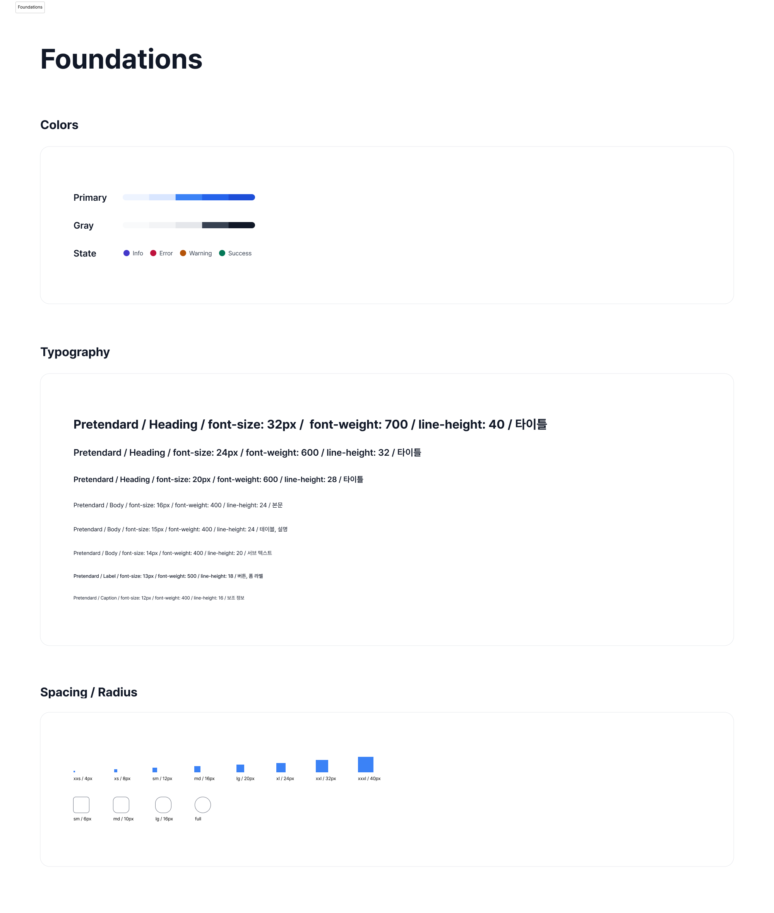
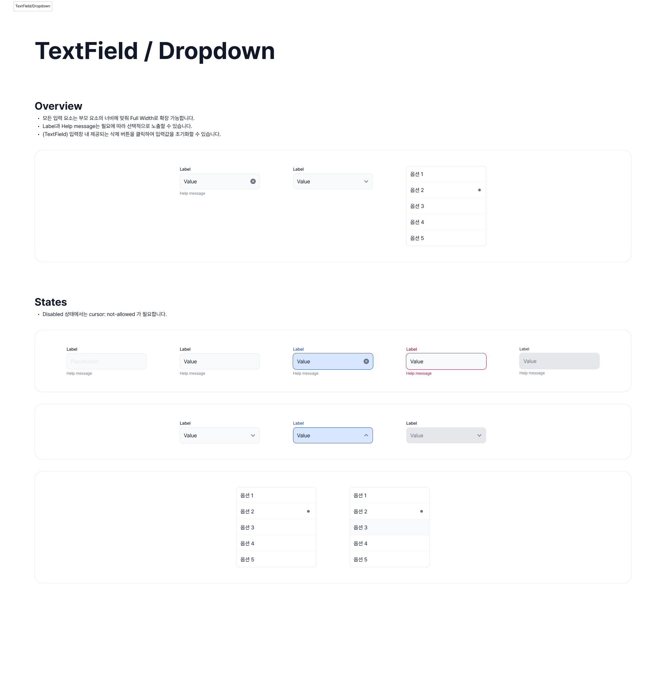
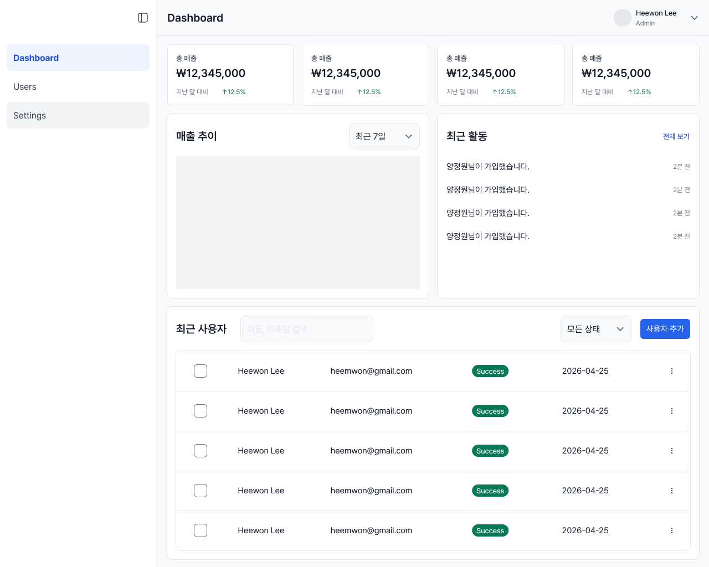

# Design System

SaaS 관리자(Admin) 대시보드를 위한 디자인 시스템입니다.  
일관된 사용자 경험과 빠른 개발 생산성, 유지보수 가능한 컴포넌트 구조를 목표로 설계했습니다.

> Design Token 기반 스타일 관리 + 접근성(A11y) 고려 + Storybook 문서화까지 포함한 UI 시스템 프로젝트입니다.

---

## Overview

SaaS Admin 대시보드를 위한 디자인 시스템입니다.

이 프로젝트는 단순 UI 컴포넌트 모음이 아니라,  
디자인 시스템 → 컴포넌트 → 문서화까지 연결되는 구조를 목표로 설계했습니다.

Figma 기반 와이어프레임과 컴포넌트 구조를 직접 설계한 뒤,
Design Token 기반 스타일 구조와 Storybook 문서화를 연결해
일관된 사용자 경험과 유지보수 가능한 UI 시스템을 구축했습니다.

- Design Token 기반 스타일 구조
- 접근성(A11y) 고려한 컴포넌트 설계
- Compound Pattern (Table, Dialog) 적용
- Tailwind v4 + Storybook 기반 문서화

---

## Figma

디자인 토큰, 컴포넌트 Variant, 와이어프레임 구조까지 직접 설계했습니다.

- Color / Typography / Spacing Token 정의
- Button / Input / Dialog 등 상태 기반 Variant 설계
- SaaS Admin 대시보드 와이어프레임 구성
- 구현 전 컴포넌트 재사용 구조 우선 설계

### Design System

- [Figma Design System](https://www.figma.com/design/gZeYjMdOmNZzv2srOaN0Ud/Design-System?node-id=0-1&t=gVKNseF3DsZHbz2F-1)

---

## Design Preview

### Token System



---

### Component



---

### Admin Wireframe



---

## Storybook

컴포넌트 문서 및 테스트 환경

### Includes

- Controls
- Docs
- Accessibility Addon
- Foundation Token Docs

```bash
npm run storybook
```

---

## Core Principles

### 1. Semantic Design Tokens

```
text-body-md
spacing-sm
radius-md
primary-600
```

숫자 중심이 아닌 의미 기반 토큰 설계로 유지보수성과 확장성을 확보했습니다.

---

### 2. Reusability

공통 UI를 컴포넌트화하여 재사용성과 일관성을 확보했습니다.

---

### 3. Accessibility First

- keyboard interaction
- focus-visible
- aria attributes
- color contrast

기본적인 접근성을 고려해 설계했습니다.

---

### 4. Scalable Structure

Dialog / Table / Form 등 확장 가능한 구조로 설계했습니다.

---

### 5. Design ↔ Frontend Alignment

디자인 단계에서 정의한 Token / Variant 구조를
실제 컴포넌트 아키텍처와 연결하는 데 집중했습니다.

Figma에서 정의한 구조를 기반으로:

- semantic token
- component variant
- state pattern
- Storybook documentation

까지 일관된 흐름으로 관리할 수 있도록 설계했습니다.

---

## Tech Stack

- React
- TypeScript
- Tailwind CSS v4
- Storybook
- clsx / tailwind-merge

---

## Project Structure

```text
packages/design-system/src
├── foundations/
├── styles/
│   └── globals.css
├── icons/
├── lib/
│   └── cn.ts
├── components/
│   ├── button/
│   ├── icon-button/
│   ├── textfield/
│   ├── dropdown/
│   ├── checkbox/
│   ├── table/
│   ├── dialog/
│   ├── skeleton/
│   └── field/
└── index.ts
```

---

## Components

### Button

- variant / size / disabled
- polymorphic 지원 (button, a, Link)

---

### IconButton

- 아이콘 전용 버튼
- aria-label 필수

---

### TextField

- label / helpMessage / clear button
- controlled / uncontrolled
- error / disabled / readOnly

---

### Dropdown

- 단일 선택
- controlled / uncontrolled
- listbox 기반 접근성

---

### Checkbox

- native input 기반
- keyboard interaction 지원

---

### Badge

- 상태 표시용 컴포넌트
- 텍스트 기반 의미 전달

---

### Table

- compound component 패턴
- semantic table 구조
- skeleton loading / empty state

---

### Dialog

- compound pattern 기반 구조
- Portal 기반 렌더링
- ESC close / focus trap / focus 복귀
- body scroll lock

---

### Skeleton

- loading 상태 표현
- Table.Skeleton 지원

---

## What I Focused On

- Design Token → Component → Documentation 흐름 설계
- Figma 기반 UI 구조와 실제 컴포넌트 구조 연결
- semantic token 기반 유지보수 가능한 스타일 시스템 구성
- Compound Pattern 기반 확장 가능한 컴포넌트 설계
- 접근성과 keyboard interaction을 고려한 인터랙션 구현
- Storybook 기반 문서화 및 컴포넌트 탐색 환경 구성

---

## Next Step

- Form validation
- Toast / Snackbar
- Animation
- Dark mode
- 테스트 코드

---

## Author

이희원 (Heewon Lee)
